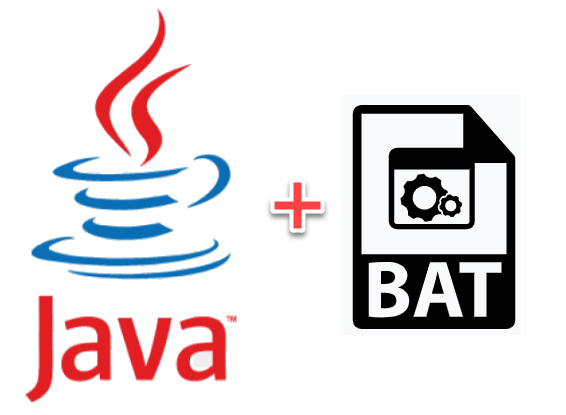

<h1 align="center">
    
</h1>

<h2 align="center">Arquivo .Bat que faz a troca da versão do java na variável de ambiemte JAVA_HOME</h2>

## 💻 Sobre o Arquivo

Este é um arquivo que foi desenvolvido para máquinas Windows que possuem várias versões do Java instaladas, ele tem a função de quando executado trocar a versão do java que está na Variável de Ambiente JAVA_HOME da sua máquina para a versão que está informada no arquivo.

## Entendendo o Arquivo
Atenção : Abaixo estou exemplificando utilizando a versão do java 14, verifique quais versões do java voce possui instaladas e faça um arquivo bat desse para cada versão passando seus caminhos respectivamente e sempre que for utilizar uma versão execute o bat da versão escolhida. 

Ex de Nome do arquivo : TrocaJavaHome_v14.bat

````bash

REM O Comando @echo off ele Faz com que o prompt fique oculto durante toda execução
@echo off

REM A linha abaixo seta o caminho informado para a variável de ambiemte JAVA_HOME
set JAVA_HOME=C:\Program Files\Java\jdk-14.0.1

REM A linha abaixo adiciona JAVA_HOME ao path
set Path=%JAVA_HOME%\bin;%Path%

REM Dá uma mensagem que a versão informada no path está ativa
echo Java 14 ativo.

````

### Pré-requisitos

Antes de começar, você vai precisar ter instalado em sua máquina as seguintes ferramentas:
- [Git](https://git-scm.com)
- As versões do Java de sua preferência. Baixe aqui [Java](https://www.java.com/pt-BR/download/)
- Editor de Código/Texto de sua preferência. Eu uso o [VSCode](https://code.visualstudio.com/)


### 🎲 Rodando o Arquivo

```bash
# Clone este repositório
$ git clone https://github.com/brunoemferreira/Arquivo-Bat-Troca-Java-Home-no-Windows.git

# Abra o arquivo com o Editor de sua preferência faça as alterações conforme sua versão do Java, salve e é só executar :) 
```
